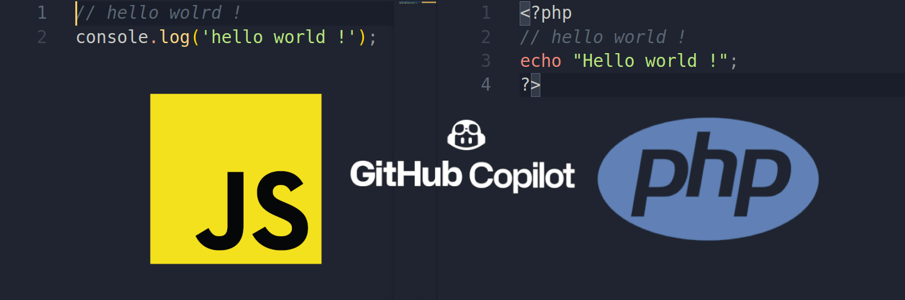

# Apprendre plus vite un nouveau langage avec GitHub Copilot
Apprendre un nouveau langage de programmation peut être une expérience longue, de grande solitude et de frustration. Surtout quand on est déjà expert dans un langage.

Imaginer un programmeur JavaScript qui veut apprendre du php ou vice-versa.

## Fini la solitude
Avec l'arriver de **GitHub Copilot** vous n'êtes plus seul sur votre éditeur de texte, vous pouvez désormais compter sur le soutien d'une intelligence artificielle crée par Microsoft.

## Toute la base de connaissance à votre porter
**GitHub Copilot** à mémoriser toutes les lignes de code sur github et les documentations des langages pour pouvoir vous suggérer des lignes code ou fonctions. Vous tapez **GitHub Copilot** vous suggère la suite ou vous propose plusieurs alternatives à vous de choisir.

## Pratique pour apprendre
Quand on apprend souvent, on se sert de Tutorielle, qui sont des exemples de code simple à reproduire pour connaître les bases du langage. Ce qui est parfait pour une intelligence artificiel encore bébé comme **GitHub Copilot**.

## Bénéficier des erreurs des autres
Vous le savez déjà, l'intelligence artificielle apprend quand des millions de gens l'utilisent, ce qui est une bonne chose dans la mesure où elle vous proposera la meilleure solution.

## Est-ce que GitHub Copilot parle français ?
Oui, et même trais bien, doc n'hésitez pas à écrire en français.

## Pour démarrer par ici
Il vous suffit de vous rendre sur le site [copilot.github.com](https://copilot.github.com), de vous inscrire et d'attendre la validation (environ une semaine pour mons cas).

## Inconvénient
Oui, il y en a bien sûr, pour pouvoir faire des suggestions **GitHub Copilot** doit lire votre code et vos données. Si votre objectif est d'apprendre et de contribuer dans l'open source il n'y a aucun danger. Sinon mieux vos désactiver **GitHub Copilot** en attendant d'en apprendre davantage sur son fonctionnement.

Happy code ;-)