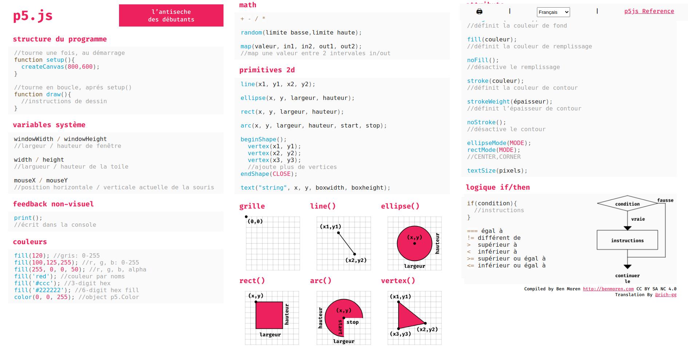

# Pilote, check liste et programmeur ?

Il m'arrive souvent de passer d'un langage à un autre, avec le temps, je ne suis plus sur de la bonne syntaxe à tapée. Pour me rafraîchir la mémoire avant un nouveau projet, j'ai recoure à une **cheat sheet (antisèche)**.

## Voici quelque unes

### [C](https://cheatography.com/tag/c/)

### [Python](https://cheatography.com/tag/python/)

### [Javascript](https://cheatography.com/tag/javascript/)

### [PHP](https://cheatography.com/tag/php/)

### [SQL](https://cheatography.com/tag/sql/)

### [MYSQL](https://cheatography.com/tag/mysql/)

### [HTML](https://cheatography.com/tag/html/)

### [CSS](https://cheatography.com/tag/css/)

### [p5.js](https://bmoren.github.io/p5js-cheat-sheet/fr.html)

Vous voulez plus de Cheat liste sur le jeu, le business, etc. Visitez. [cheatography.com](https://cheatography.com)