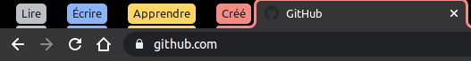
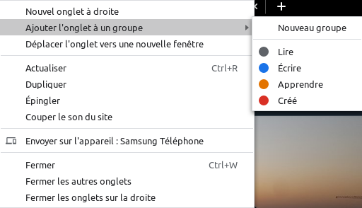

# Google Chrome, onglets groupés

Êtes-vous adepte des onglets à l'infini sur votre navigateur ? Si oui utilisez les onglets groupés, pour mieux navigué et organiser votre travail.

## Comment faire ?

Faites un clic droit sur un onglet et choisissez de l’**Ajouter à un nouveau groupe**. L’onglet se voit attribuer automatiquement une couleur.

Cliquez ensuite sur une pastille colorée pour modifier la couleur de votre groupe, mais aussi pour lui donner un nom.

## Voilà

Vous voulez en apprendre d'avantage cliqué [ici](https://support.google.com/chrome/answer/2391819?co=GENIE.Platform%3DDesktop&hl=fr).
