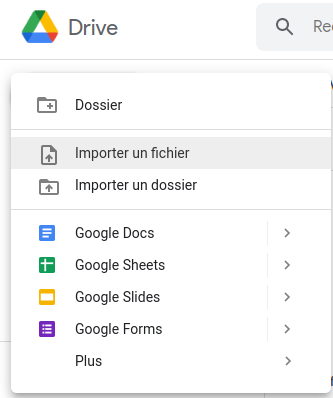
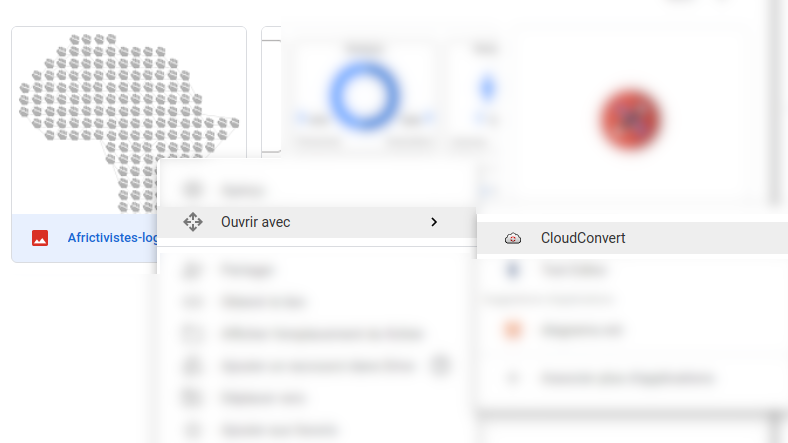
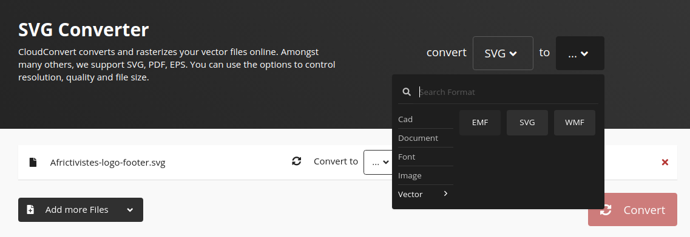
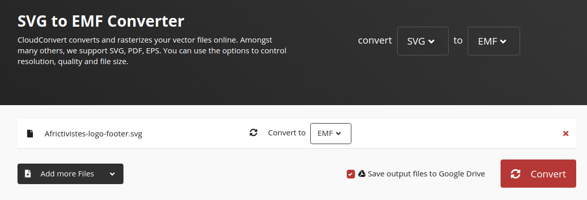
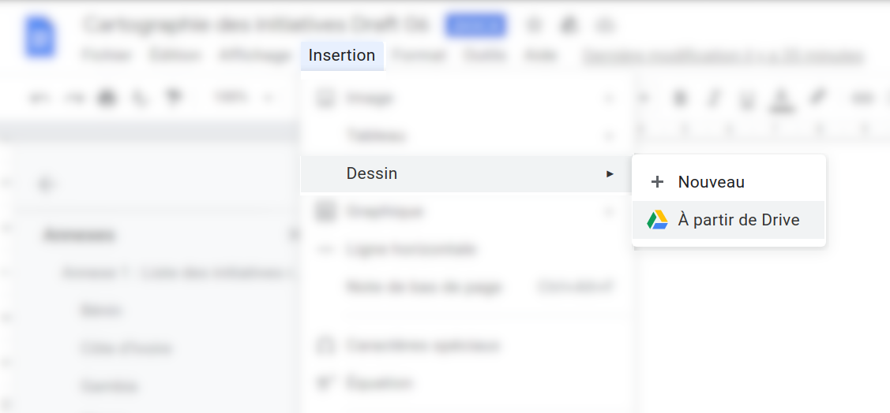
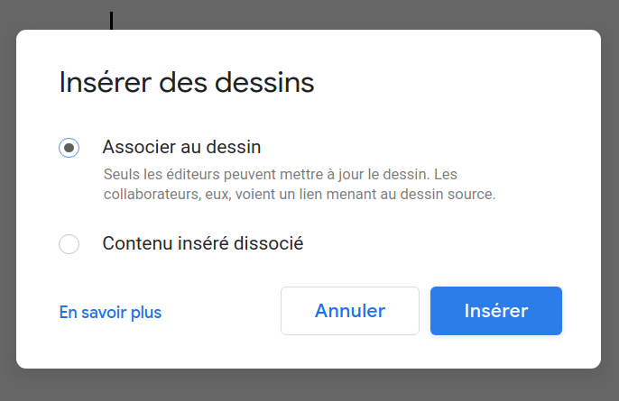
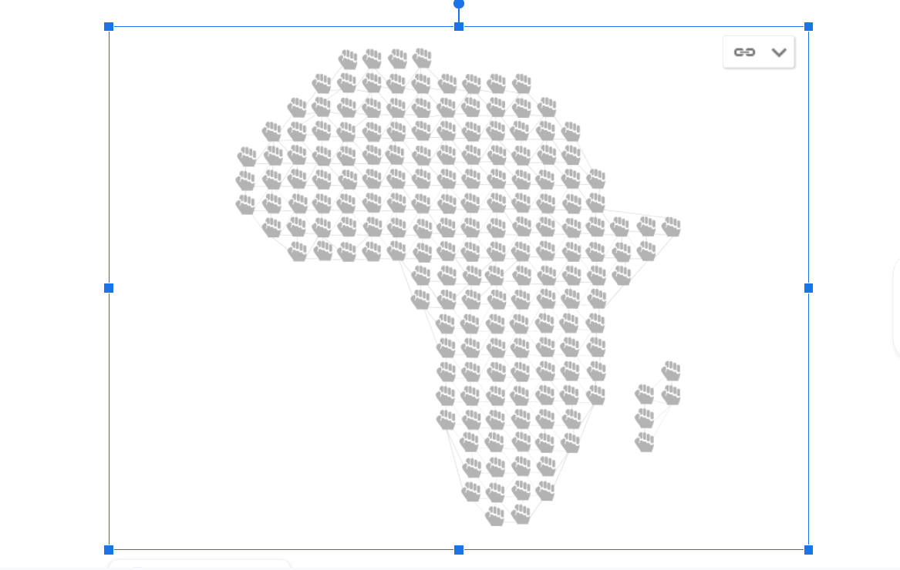

# SVG dans Google Drive (Docs, Sheets, Slides)

1. **Importe** ton fichier dans **Google Drive**

2. Un **clic droit** sur le **fichier importé**, puis choisir **Ouvrir avec > cloudConvert**

3. Une nouvelle fenêtre s'ouvre vous propose de vous connecter, puis de convertir votre fichier choir dans **to > Vector > EMF**

4. Appuyer sur le bouton **Convert**

5. Après conversion, le nouveau fichier **EMD** est dans votre **Google Drive** au même emplacement que le fichier **SVG**, insérez dans votre Google Docs, Sheets ou Slides en cliquant sur **À partir de Drive**

6. Faites votre choix

7. Et voilà

