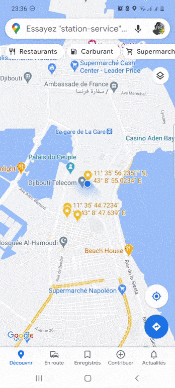

## Mobile, Google map en mode privée

C'est possible, mais attention cela ne signifie pas que votre navigation est privée.
Google Maps ne fait rien pour masquer ou anonymiser votre trafic Web vers le monde extérieur. Il minimise simplement l'enregistrement de votre navigation sur Maps dans votre propre compte Google et offre un moyen de suspendre le partage de position avec d'autres utilisateurs de Maps depuis cet appareil.

## Les Avantages

- Navigation plus rapide (pas de recommandation de lieu par Google, ni de visibilité sur vos personnalisations ou lieu enregistres)
- Donc consommer moins de data et économiser vos forfaits mobiles

Pour utiliser le mode de navigation privée dans Maps, appuyez simplement sur la photo de votre compte dans le coin supérieur droit de l'écran (à côté de la barre de recherche) et appuyez sur **activer le mode navigation privée**.

