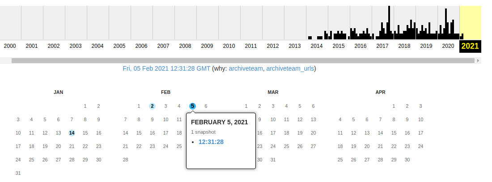
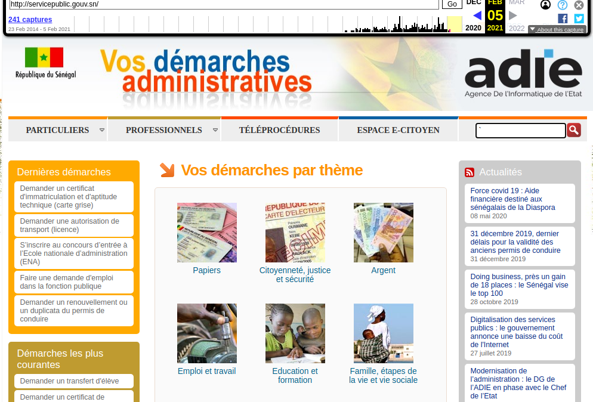

# Comment récupérer un site effacée ?

Pour un nouveau projet Civic Tech, j'avais besoin des données du site [servicepublic.gouv.sn](http://www.servicepublic.gouv.sn) mais hélas ce site marche une fois sur deux avec des liens qui casse.Si vous vous aussi rencontre le même problème avec un site ou celui-ci n'hésite même plus sur Internet ? Pas de panique avec [archive.org]() vous pouvais récupérer votre site.

## Comment faire ?

* Allez sur
[archive.org](https://archive.org)
* Tapez l'adresse de vote site dans la zone de recherche.
  Avec de la chance, votre site a été archivé.
[archive.org](https://archive.org)
    

* Choisir une date d'archive et voilà
[archive.org](https://archive.org)
    

    

## Retrouvez l'archive des 1925 démarches administratives de [servicepublic.gouv.sn ici](https://github.com/senegalouvert/servicepublic/tree/main/data)